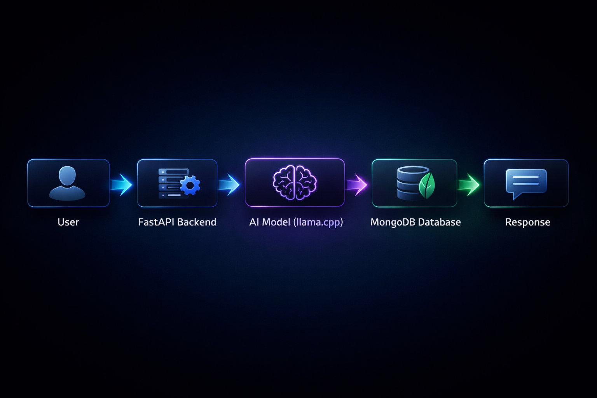
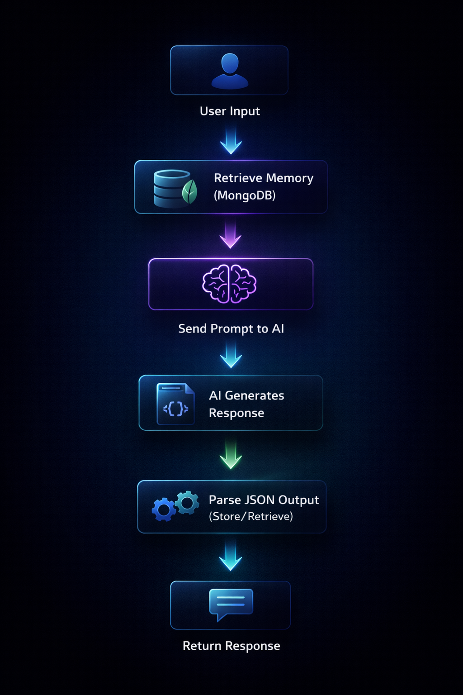

Title: Day 3 – Building an End-to-End AI Pipeline  
Date: 2026-04-15  
Category: GenAI  
Tags: GenAI, AI Pipeline, llama.cpp, MongoDB  
Slug: day3-ai-pipeline-memory-system  
Status: published  

## Introduction

In real-world AI systems, models alone are not enough. They need memory, structured outputs, and backend logic to work effectively.

To understand this, I built a simple end-to-end AI pipeline using a local model (llama.cpp) and MongoDB.

In this session, I focused on:

- Running a local AI model  
- Structuring AI responses  
- Storing and retrieving data  
- Building a stateful AI system  

---

## 1. Understanding the AI Pipeline

### Flow

User → FastAPI → AI (llama.cpp) → Decision → MongoDB → Response



This pipeline shows how AI systems process input, use memory, and return meaningful responses.

---

## 2. Running a Local AI Model

I used llama.cpp with a GGUF model to run the AI locally.

- Temperature → controls creativity  
- Top-p → controls randomness  
- Max tokens → controls response length  

This allows better control, privacy, and offline capability.

---

## 3. Structuring AI Output

```
TOP:
Response for user

BOTTOM_JSON:
{
  "action": "store" | "retrieve" | "none",
  "data": "..."
}
```

This helps the system understand and act on AI responses.

---

## 4. MongoDB as a Memory System

```json
{
  "text": "User likes AI",
  "date": "2026-04-15"
}
```


## 5. Building Stateful AI

- Store user inputs  
- Retrieve memory  
- Use it in responses  

---

## 6. AI Decision Making

- store → save data  
- retrieve → fetch data  
- none → normal response  

---

## 7. Pipeline Execution Logic

1. Receive user input through FastAPI  
2. Retrieve memory from MongoDB  
3. Send the prompt to the AI model  
4. Generate a structured response  
5. Parse the JSON output  
6. Execute the required action  
7. Return the final response  



---

## Final Thoughts

This project helped me understand how AI models, backend systems, and databases work together to build real-world applications.

By combining llama.cpp, MongoDB, and structured outputs, I built a simple system that can respond, remember, and take actions.