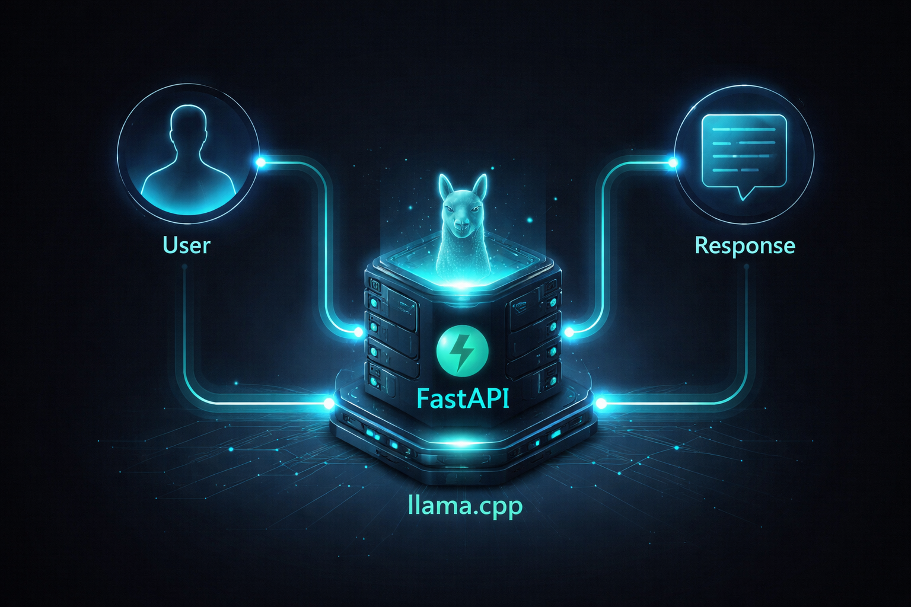

Title: Day 6 – FastAPI + llama.cpp Integration  
Date: 2026-04-18
Category: GenAI  
Tags: GenAI, FastAPI, LLM, llama.cpp  
Slug: day6-fastapi-llm-api  
Status: published  

## Introduction

Day 6 of my GenAI Learning Challenge.

Today, I integrated a local LLM with FastAPI to build a usable AI backend. Instead of running the model separately, user input is sent through an API and processed by llama.cpp.

This is a key step toward building real AI applications.

---

## 1. Workflow  

User → FastAPI → llama.cpp → Response  

- API receives input  
- Model generates output  
- Response is returned  

---


## 2. FastAPI Setup  

```python
from fastapi import FastAPI

app = FastAPI()

@app.get("/")
def home():
    return {"message": "API running"}

```
FastAPI acts as the interface between the user and the model, handling incoming requests and returning responses.

---

## llama.cpp Integration  

```python
from llama_cpp import Llama

llm = Llama(
    model_path="models/model.gguf",
    n_ctx=2048,
    n_threads=4
)
```

---


## Input Schema  

```python
from pydantic import BaseModel

class PromptRequest(BaseModel):
    prompt: str
    max_tokens: int = 100
    temperature: float = 0.7

```
---

## Generate Endpoint  

```python
@app.post("/generate")
def generate(req: PromptRequest):
    output = llm(
        req.prompt,
        max_tokens=req.max_tokens,
        temperature=req.temperature
    )

    return {"response": output["choices"][0]["text"]}
```
---

## Controlling Output  

```json
{
  "prompt": "Explain AI",
  "max_tokens": 80,
  "temperature": 0.7
}

```

The response can be controlled using parameters like temperature for creativity and max_tokens for response length.

---

## Testing  

Swagger UI:  
http://localhost:8000/docs#/  

```bash
curl -X POST "http://127.0.0.1:8000/generate" \
-H "Content-Type: application/json" \
-d "{\"prompt\":\"Tell me a joke\"}"

```
The API can be tested using Swagger or curl to ensure the model and backend are working together correctly.

---

## Execution Flow  

The system works by receiving user input through FastAPI, validating it, sending it to the model, generating a response, and returning it as JSON.

## Execution Flow  



---

## Final thoughts 

I successfully built a working AI API by integrating FastAPI with llama.cpp. This helped me understand how AI models are served as backend systems and how their outputs can be controlled. This forms the foundation for building real-world AI applications.
